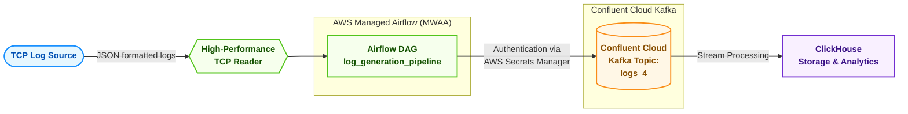

# MWAA Kafka Log Processing Pipeline

A high-performance log processing solution that reads logs from TCP streams, processes them with Apache Airflow (MWAA), and ingests them into Confluent Cloud Kafka topics for downstream consumption by ClickHouse.

## Architecture

The following diagram illustrates the data flow through the system:



### Components:

1. **TCP Log Source**: Generates JSON-formatted log events that are streamed over TCP.
2. **High-Performance TCP Reader**: A custom-built TCP client that efficiently reads log streams with minimal overhead.
3. **Airflow DAG**: An Apache Airflow DAG that processes the log streams and forwards them to Kafka.
4. **Confluent Cloud Kafka**: A fully managed Kafka service that serves as a buffer for log events.
5. **ClickHouse**: A columnar database that consumes logs from Kafka for storage and analysis.

## Project Structure

```
mwaa-kafka-project/
├── dags/
│   ├── log_producer.py    # Airflow DAG for producing logs to Kafka
│   └── tcp_reader.py      # High-performance TCP reader implementation
├── pyproject.toml         # Project dependencies and metadata
├── README.md              # This documentation file
└── .gitignore             # Git ignore rules
```

### DAGs

- **log_generation_pipeline**: Reads logs from a TCP source and produces them to a Kafka topic.
  - Schedule: Every 5 minutes (Only set as an example, it runs continuously)
  - Task: `generate_and_produce_logs`

## Prerequisites

- Python 3.12 or higher
- Apache Airflow 2.10.5 or higher
- Confluent Cloud Kafka cluster
- AWS account (for Secrets Manager)
- ClickHouse instance (for log storage and analysis)


## Installation

1. Clone the repository:
   ```bash
   git clone <repository-url>
   cd mwaa-kafka-project
   ```

2. Install dependencies:
   ```bash
   pip install -e .
   ```

## Local Development Setup

Follow these steps to set up the project locally:

1. Set the `AIRFLOW_HOME` variable for each shell session:
   ```bash
   export AIRFLOW_HOME=$(pwd)
   ```

2. Initialize the Airflow database:
   ```bash
   airflow db init
   ```

3. Run Airflow database migrations:
   ```bash
   airflow db migrate
   ```

4. Create an admin user:
   ```bash
   airflow users create \
     --username admin \
     --firstname Admin \
     --lastname User \
     --role Admin \
     --email admin@example.com \
     --password admin
   ```

5. Start the Airflow webserver (in a separate terminal with `AIRFLOW_HOME` set):
   ```bash
   export AIRFLOW_HOME=$(pwd)
   airflow webserver
   ```

6. Start the Airflow scheduler (in a separate terminal with `AIRFLOW_HOME` set):
   ```bash
   export AIRFLOW_HOME=$(pwd)
   airflow scheduler
   ```

7. Access the Airflow UI at http://localhost:8080

## Configuration

### AWS Secrets Manager

The project retrieves Confluent Cloud Kafka credentials from AWS Secrets Manager. You'll need a secret named `MWAA_Secrets` with the following structure:

```json
{
  "KAFKA_BOOTSTRAP_SERVER": "your-confluent-cloud-bootstrap-server:9092",
  "KAFKA_SASL_USERNAME": "your-confluent-cloud-api-key",
  "KAFKA_SASL_PASSWORD": "your-confluent-cloud-api-secret"
}
```

For local development, you can:

1. Create the secret in AWS Secrets Manager
2. Configure AWS credentials locally
3. Ensure the region is set correctly (default: "us-east-1")

### Kafka Configuration

Confluent Cloud Kafka is configured to use SASL_SSL security with PLAIN authentication. The configuration is retrieved from AWS Secrets Manager.

## ClickHouse Configuration for Kafka Integration

ClickHouse needs to be properly configured to consume log data from the Confluent Cloud Kafka topic. Follow these steps to set up the integration:

### 1. Configure ClickHouse for Confluent Cloud Authentication

Add the following credentials to your ClickHouse `config.xml` file. This configuration is necessary because SASL authentication details cannot be passed directly through DDL commands.

```xml
<clickhouse>
   <kafka>
       <sasl_username>your-confluent-cloud-api-key</sasl_username>
       <sasl_password>your-confluent-cloud-api-secret</sasl_password>
       <security_protocol>sasl_ssl</security_protocol>
       <sasl_mechanisms>PLAIN</sasl_mechanisms>
   </kafka>
</clickhouse>
```

### 2. Create a Dedicated Database for Log Storage

Create a separate database to keep log data organized:

```sql
CREATE DATABASE KafkaEngine
```

### 3. Create the Target Table for Processed Logs

This table uses the MergeTree engine, which provides efficient storage and querying capabilities:

```sql
CREATE TABLE logs (
    eventId UInt32,                      -- Unique event identifier
    level LowCardinality(String),        -- Log level (Warning, Error, Info, etc.)
    source LowCardinality(String),       -- Source system generating the log
    timestamp DateTime64(6),             -- Timestamp with microsecond precision
    computer LowCardinality(String),     -- Server/computer name
    user LowCardinality(String),         -- User associated with the event
    message String                       -- Full log message content
) ENGINE = MergeTree 
  PARTITION BY toYYYYMM(timestamp)       -- Partition by year and month for efficient storage
  ORDER BY (eventId)                     -- Primary sort key for optimized retrieval
```

### 4. Create a Kafka Engine Table for Stream Ingestion

This table connects directly to Confluent Cloud Kafka and serves as the ingestion point:

```sql
CREATE TABLE logs_queue (
    eventId UInt32,
    level LowCardinality(String),
    source LowCardinality(String),
    timestamp DateTime64(6),
    computer LowCardinality(String),
    user LowCardinality(String),
    message String
) ENGINE = Kafka(
    'your-confluent-cloud-bootstrap-server:9092',  -- Kafka bootstrap server
    'logs_4',                                      -- Kafka topic name
    'logs_consumer',                               -- Consumer group ID
    'JSONEachRow'                                  -- Message format (JSON)
) 
SETTINGS 
    kafka_thread_per_consumer = 0,                 -- Use shared thread pool
    kafka_num_consumers = 1,                       -- Number of consumer threads
    kafka_row_delimiter = '\n',                    -- Newline delimiter for messages
    format_schema = 'json';                        -- Schema format identifier
```

### 5. Create a Materialized View to Bridge the Tables

The materialized view automatically processes data from the Kafka table and inserts it into the storage table:

```sql
CREATE MATERIALIZED VIEW logs_mv 
TO logs                                  -- Target table (MergeTree)
AS SELECT * FROM logs_queue;             -- Source table (Kafka Engine)
```

This setup creates a continuous pipeline where:
1. Log data streams into Confluent Cloud Kafka
2. ClickHouse continuously pulls data from Kafka using the `logs_queue` table
3. The materialized view transforms and loads the data into the `logs` table
4. Data becomes immediately available for analytics and querying

### Example Queries for Log Analysis

Once your logs are flowing into ClickHouse, you can run powerful analytical queries:

```sql
-- Count logs by level in the last hour
SELECT 
    level, 
    count() AS count 
FROM logs 
WHERE timestamp >= now() - INTERVAL 1 HOUR 
GROUP BY level 
ORDER BY count DESC;

-- Find top error sources
SELECT 
    source, 
    count() AS error_count 
FROM logs 
WHERE level = 'Error' 
GROUP BY source 
ORDER BY error_count DESC 
LIMIT 10;

-- Time series of logs by minute
SELECT 
    toStartOfMinute(timestamp) AS minute, 
    count() AS log_count 
FROM logs 
WHERE timestamp >= now() - INTERVAL 1 DAY 
GROUP BY minute 
ORDER BY minute;
```

## Deployment to AWS MWAA

To deploy this project to AWS MWAA:

1. Ensure that all dependencies are listed in `pyproject.toml`
2. Push your code to a git repository
3. Configure MWAA to use your repository
4. Set up the appropriate IAM roles for MWAA to access Secrets Manager
5. Configure your VPC to allow MWAA to access Confluent Cloud Kafka

## Usage

### Running the DAG

The DAG will run automatically based on its schedule. You can also trigger it manually from the Airflow UI.

### Monitoring

- **Logs**: Check Airflow logs for any issues with log ingestion
- **Kafka**: Monitor the `logs_4` topic in Confluent Cloud for log events
- **ClickHouse**: Query the ClickHouse database to analyze ingested logs

## Implementation Details

### TCP Reader

The project includes two TCP reader implementations:

1. `TCPLogReader`: A basic implementation with queue-based buffering
2. `HighPerfTCPReader`: A high-performance implementation with optimized buffering and threading

### Kafka Producer

The Kafka producer is configured to use SASL_SSL security with credentials from AWS Secrets Manager to connect to Confluent Cloud.